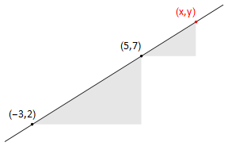

# Differentiation
## Motivations and First Principle Arguments

The equation $y=mx+c$ represents a straight line. In this expression, the constant $m$ tells us how quickly the slope $y$ changes with $x$.

For instance,

* if $m$=1 then 𝑦 increases by 1 unit for every unit of increase in $x$
* if $m$=2 then 𝑦 increases by 2 units for every unit of increase in $x$
* if $m$=−2 then 𝑦 decreases by 2 units for every unit of increase in $x$


```{admonition} Example
:class: tip
**Problem**: Find the slope of the straight line connecting the points (-3,2) and (5,7).

**Solution**:



The straight line that can be drawn through the points (-3,2) and (5,7).

* the change in $x$ is given by Δ$x$=(5+3)=8

* the change in $y$ is given by Δ$y$=(7−2)=5

So $y$ increases by 5 units for every 8 units of increase in $x$

The rate of change of $y$ with $x$ (the slope) is $\frac{Δy}{Δx}$ = $\frac{5}{8}$ (This is the constant $m$ in the equation of the line $y=mx+c$)

Triangles drawn under the line have the same slope. By considering a triangle connecting the point (5,7) to ($x$,$y$), we could write
$\frac{y−7}{x−5}$ = $\frac{5}{8}$, which rearranges to $y$=$\frac{5}{8}x$ + $\frac{31}{8}$.

```
In a curve, the slope is not constant, but we can identify the slope at any point by drawing the tangent to the curve at that point. The tangent is the line that "just touches" the curve, and the normal is the line that is at right angles to the tangent.

```{figure} slope.png
---
name: Tangent_and_Normal
---
The tangent at the point is indicated in blue and the normal is indicated in red.  If the tangent has slope $m$ then the normal has slope −1/$m$.
```
In {numref}`Tangent_and_Normal` we can see that if we moved the point along the curve, both the slope of the tangent line and the normal line change.  We are interested in finding a mathematical expression for the slope of a curve at any given point $x$.


```{figure} height-base.png
---
name: Height_Base
---
The curve shows a hypothetical function $f$, and the black dashed line shows the tangent at the arbitrary point $(x,f(x))$. The slope of this line is the **height:base** ratio in the gray shaded triangle
```
As a first approximation, we construct a secant on the curve by joining $x$ to a nearby point $x+Δx$. (Here, $Δx$ means a small change in the parameter $x$). This result is shown graphically in {numref}`Height_Base`, we consider the secant line joining $(x,f(x))$ to a nearby point $(x+Δx,f(x+Δx))$

The slope of the secant line is given by: 
```{math}
:label: slope_secant
\frac{Δf}{Δx}=\frac{f(x+Δx)−f(x)}{Δx}
```


## Derivative as a "rate of change"
## Second and Higher Derivatives
## Stationary Points
## Differentiation Rules
## Parametric Differentiation
## Derivatives of Inverse Functions
## Implicit Differentiation
## Solutions

