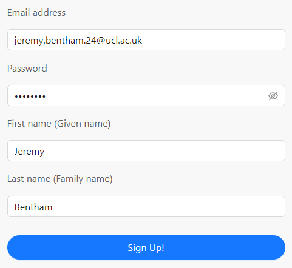
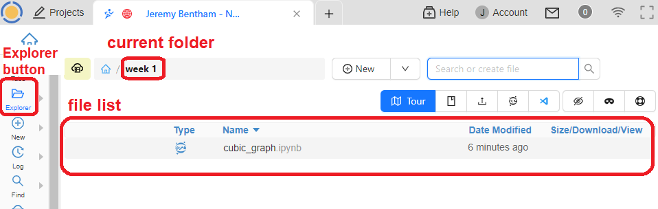
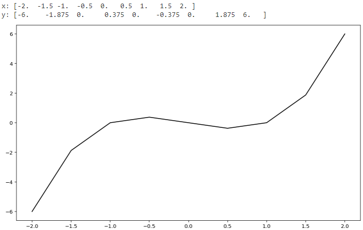

---
jupytext:
  formats: md:myst
  text_representation:
    extension: .md
    format_name: myst
    format_version: 0.13
    jupytext_version: 1.10.3
kernelspec:
  display_name: Python 3
  language: python
  name: python3
---

# Using CoCalc

We will be using an online platform called *CoCalc* to run and edit *notebooks* containing code written in the *Python* programming language. By the end of the workshop you will be comfortable creating, editing and running notebook files using the platform. You will also see some Python code, but don't worry as you’re not expected to understand it yet.

```{admonition} What you will learn

After completing this section you should be able to:

* Log in to CoCalc and open a project
* Open, edit and run notebooks
* Create markdown and code cells
```

## Initial steps

Before using CoCalc for the first time you will need to create an account. You will need to do this using your UCL email address, because a licensed, personal project has already been set up for you linked to that email. Follow the steps below to setup your account and access your project.

<h4> ✓  Create your account</h4>

> Open the Cocalc web site [www.cocalc.com](https://cocalc.com/auth/sign-up) and click . Enter the requested information to create your account. You must use your UCL email in its long form, which may be similar to [firstname.lastname.24@ucl.ac.uk](https://myaccount.microsoft.com/?ref=MeControl).



<h4> ✓ Access your project</h4>

> Click on  in the top-left corner.

You should see a project titled something like '[your name] - NSCI0005'.
> Click on the project '[your name] - NSCI0005' to open it.

Your project is essentially a virtual computer hosted in the cloud, including operating system (Linux) and preinstalled software libraries so that you can start programming with Python straight away.

```{attention}
If you don't see a project named '[your name] - NSCI0005', ask an instructor for help before continuing.
```

<h4> ✓ Open a notebook file</h4>

The project contains a file system much like an ordinary personal computer. Files are organised in folders, and you can use the CoCalc 'Explorer' to navigate between the folders and to open files.

>Click the  button on the left toolbar to open the file explorer.

The file explorer shows you the currently selected folder and the list of files contained within.



Your course instructors have added some files to your project to get you started. All of the files in the project are your own. For example, every student has their own individual copy of the `cubic_graph` notebook.

> Click on the folder `week 1` then click the file `cubic_graph.ipynb` to open it.

The extension `.ipynb` indicates that the file is a Jupyter notebook, also known as an IPython notebook. This type of file contains Python code and formatted text allowing us to combine computations, results and descriptive text in a single file.

<h4> ✓ Inspect and run the file</h4> 

A Jupyter notebook file is split up into **cells**, which can be of two types. **Code cells** contain Python code, and **markdown cells** contain formatted text. You can select a cell by clicking it with the mouse or using the up and down arrows on your keyboard, and run the selected cell by clicking the run button in the toolbar.


This notebook contains two cells, a markdown cell and a code cell. 

> Select the code cell and run it by clicking the  button.

Running the code will result in some text and a line graph appearing directly below the cell.




```{admonition} Keyboard shortcut
:class: tip
Instead of clicking the run button, we can use the keyboard shortcut `Shift + Enter` to run a cell and automatically move to the cell below.
```

## Notebook editing

Now that you opened and ran your first notebook, you can start to experiment with its editing features. Don't worry about messing it up as you can always undo any changes.

<h4> ✓ Edit a code cell </h4>

Jupyter notebooks have two different modes, **edit** and **command**. To change to edit mode press the `Enter` key; to return to command mode, press the `Esc` key. Clicking on a cell with the left mouse button will also put the cell into edit mode. When a cell is in edit mode the left hand border will turn green and when it is in command mode it will turn blue.

Let's change the code so that it generates a red graph rather than black.

> 1. Select the bottom code cell so that it is in edit mode
> 2. Change the final line to read `plt.plot(x, y, "red");`
> 3. Return to command mode by pressing `Esc`.
> 4. Run the code cell by clicking the  button.

The line graph should now be red instead of black.

<h4> ✓ Create a code cell</h4>

Next we would like to add a new code cell which plots a sine curve.

> Select the bottom cell. From the floating menu below the cell, choose the  option.

A new empty cell will be created immediately below.

> Copy and paste the following lines of code into the new code cell, then run the code cell.

```
# Plot a sine graph

x = np.linspace(-4*np.pi, 4*np.pi, 100)
y = np.sin(x)

fig = plt.figure()
plt.plot(x, y);
```

You should see a graph of a sine curve.

<h4> ✓ Delete a cell</h4>

To delete a cell, first select the cell then press `x`. The cell must be in command mode. If the cell is in edit mode, pres `Esc` first. 

> Delete the code cell you just created.

